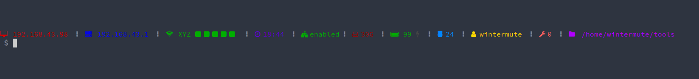

<h1 align="center"> POWERPROMPT </h1>  

  

 Powerprompt is an informative, colorful prompt for Zsh

It shows various data:

* Local ip address
* Router's ip address
* Network name and signal strength
* Current time
* AppArmor status
* Free disc space
* Battery level and AC adapter status
* CPU usage
* Current username
* Number of running background jobs
* Current directory

## Usage
Append the contents of `powerpromt.zsh` to your `.zshrc` config file:

`cat powerprompt.zsh >> ~/.zshrc`

